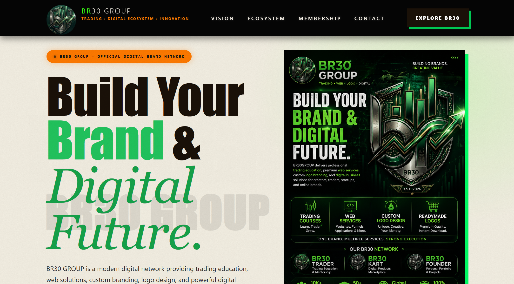
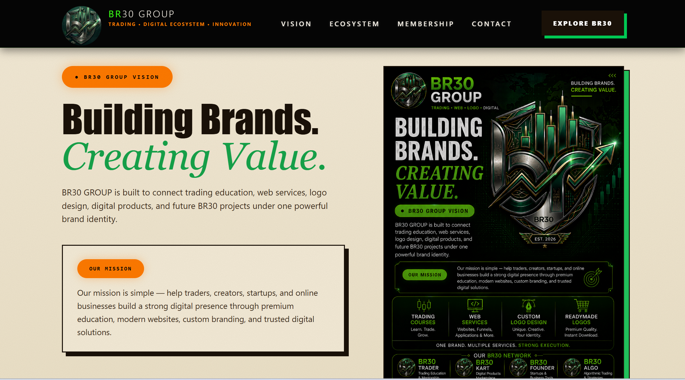

# BR30 Group

🚀 **BR30 Group** is the central ecosystem website connecting all BR30 projects, businesses, platforms and future ventures under one unified brand.

The platform serves as the official gateway to the BR30 ecosystem, including trading education, digital marketplaces, technology projects, founder portfolio and upcoming products.

---

## 🌐 Live Website

[🚀 Visit BR30 Group](https://br-30-group-com.vercel.app/)

---

## 🌟 Features

- BR30 Ecosystem Showcase
- Explore BR30 Dropdown Navigation
- Modern React Architecture
- Mobile Responsive Design
- Fast Loading Performance
- Founder Portfolio Integration
- Business Services Showcase
- Project Discovery Platform
- Community Integration
- Social Media Integration
- SEO Optimized Pages
- Future Expansion Ready

---

## 🛠️ Tech Stack

### Frontend


---

### Deployment


---

### Development Tools


---

---

## 🌐 BR30 Ecosystem

| Project                | Description                           | Live Demo                                                           |
| ---------------------- | ------------------------------------- | ------------------------------------------------------------------- |
| 🚀 BR30 Trader         | Trading Education Platform            | [Visit Website](https://my-frontend-eight-roan.vercel.app/)         |
| 🛒 BR30 Kart           | Digital Marketplace Platform          | [Visit Website](https://br-30-kart.vercel.app/)                     |
| 👨‍💻 BR30 Founder        | Personal Portfolio Website            | [Visit Website](https://br30-com.vercel.app/)                       |
| 📈 BR30 Algo           | Trading Technology Project            | [Visit Website](https://br30algo-com.vercel.app/)                   |
| 🌐 BR30 Group          | Central Ecosystem Website             | [Visit Website](https://br-30-group-com.vercel.app/)                |
| 📊 BR30 Market Scanner | Multi-Market Trading Scanner Platform | [Visit Website](https://br30marketscanner-com-frontade.vercel.app/) |

---

## 📁 Project Structure

```bash
BR30GROUP.COM-F
│
├── public/
│   ├── image/
│   ├── robots.txt
│   └── sitemap.xml
│
├── screenshots/
│
├── src/
│   │
│   ├── components/
│   │   ├── Connect.jsx
│   │   ├── Eligibility.jsx
│   │   ├── Footer.jsx
│   │   ├── Hero.jsx
│   │   ├── JoinBanner.jsx
│   │   ├── Manifesto.jsx
│   │   ├── Marquee.jsx
│   │   ├── Navbar.jsx
│   │   ├── ScrollToTop.jsx
│   │   ├── TopStrip.jsx
│   │   └── Vision.jsx
│   │
│   ├── pages/
│   │   ├── AboutUs.jsx
│   │   ├── ContactPage.jsx
│   │   ├── Home.jsx
│   │   ├── Privacy.jsx
│   │   ├── Refund.jsx
│   │   └── Terms.jsx
│   │
│   ├── App.jsx
│   ├── main.jsx
│   └── routes.jsx
│
├── .env
├── .gitignore
├── .prettierrc
├── index.html
├── package-lock.json
├── package.json
├── README.md
├── vercel.json
└── vite.config.js
```

---

## 📸 Screenshots

### 🏠 Home Page



---

### 🏢 Building Brand Section



---

### 🤝 Connect With BR30


---

### 🎯 The Five Goals


---

### 👥 Join Group Section


---

### 💎 Membership Section


---

### 📂 Explore BR30 Dropdown


---

### 🔻 Footer Section


---

## 🚀 BR30 Vision

BR30 Group aims to build a complete digital ecosystem that combines:

- Trading Education
- Digital Products
- Technology Solutions
- Community Building
- Business Growth

under a single trusted brand.

---

## 👨‍💻 Developed By

**Mukesh Raj**

Founder & Creator of **BR30 Group**

---

## 📬 Connect With Me

[](https://www.linkedin.com/in/mukeshraj-br30/)

[](https://github.com/mukeshkumarsingh7488-afk)

[](https://www.instagram.com/br30Traderofficial)

[](https://www.youtube.com/@br30traderofficial)

[](https://t.me/+hBAT4kWo63A4ZWY1)

[](https://www.facebook.com/share/1DDJYGYYDf/)

[](https://x.com/MukeshKuma48159)

---

## 🚀 Project Status

BR30 Group is actively maintained and continuously improved with new ecosystem integrations, services, projects and business solutions.

---

### Build • Innovate • Connect • Grow 🚀
